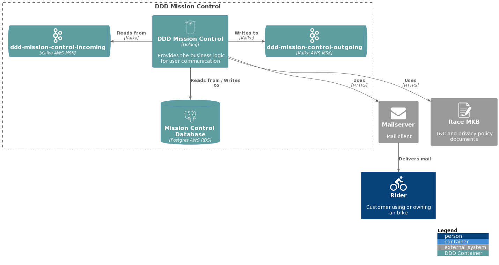

# Bicycle Racing Platform

### High Level Architecture Design
This is the DDD Mission Control (MC) service. It is supposed to centralize user communication over different 
communication channels. See [usecases.md](usecases.md) for C4 architecture diagrams and an explanation of the implemented use cases.

The diagram belows shows the high level component diagram that could be used to fulfil the requirements.

### Technology Stack 

### Fault Tolerance

To increase the fault tolerance all incoming kafka traffic is handled in the same way on failure:
1. If processing fails, we store the failed message in a failed message log. We continuously pull messages from this log to retry.
2. If an immediate retryable error happens, an error is returned to the kafka `Subscribe` handler and the offset is not committed.
This means the message will remain in the queue and will be pulled again. 
This happens infinitely, but the max number of retries can be configured (after which the pod is killed).
All of this is to avoid dropping messages.
In practice, we only return an error if we fail to store the message in the failed message log (e.g. if the database is inaccessible.)

Since we deal with fault tolerance through retries, we have to be able to deal with the same message multiple times through idempotent handling.
For instance, if we receive the same request to send out a mail twice, we should only send out one. 

The combination of a distributed event system and a local retry queue, mean we relatively often process out-of-order messages.
To deal with these, we compare timestamps of when the message was sent to avoid stale updates.

MC has two external dependencies, chiefly the mailserver for sending out mails and the Race MKB CDN for legal documents.
We communicate with both services over http with a configurable timeout (default 10s).
Every day a few requests fail due to timeout errors and only get picked up

#### TODO: (## Technical Decisions ## Biggest Challenges)
 * Make retry exponentially backoff rather than static once-per-day retry
 * Immediate http retries (circuit breaker?)
 * More accurate http timeouts (10s default used everywhere) 
 
### Debugging and Monitoring
For the current health of MC, we are able to use the grafana dashboard.

Service logs can be viewed through `kubectl` or kibana. 

### Liveness and Readiness Probes
Kubernetes uses liveness probes to know when to restart a container and readiness probes to know when a container is ready to accept traffic.
The Kubernetes liveness and readiness probes of the service can be configured in the `deployments/deployment.yaml` of the service.
The liveness/readiness implementation can be found in the internal/healthcheck package.

### Kafka
MC reads and writes Kafka messages in order to communicate with other services. As the C4 diagram shows, MC reads from the `ddd-mission-control-incoming`
topic and writes to the `ddd-mission-control-outgoing` topic. The configuration of these topics can be decided. Configuration needs include #partitions and retention days.

Messages from and to other services (or from the app) are routed from and to MC via the `devops-router`. The `router` writes messages to `ddd-mission-control-incoming` and reads from `ddd-mission-control-outgoing`.
The certificates required to access these topics will be read from Vault and stored as external secrets during the deployment. The certificates will be managed by devops and rolled automatically.

Messages (also called data points) will be defined in  a central [cloud data model] as protobuf contributions. Each data point has a unique address that identifies it across all of Bike (both system and cloud).
Write and read permissions regarding the data points needs be defined in the [data privacy enabler].

MC is system-release independent (i.e. it does not care about the software configuration on the bike e.g. MY23).
The read/write permissions of MC needs be stored. 
The data privacy enabler allows for different configurations per environment and needs be configured.
The [data model web page] provides a more user-friendly overview of data points and permissions. 

An [envelope] contains one or more messages,
which contains metadata about the contained data points (such as userID, timestamps, data point address, etc.).
An envelope can be uniquely identified by its correlationID + sequenceNumber.
Most commonly, an envelope contains a single message.

## Runtime Cost Analysis

Service Name: Amazon EKS
Monthly cost: 73.00 USD

US East (N. Virginia)	
Number of EKS Clusters (1)

-
Service Name: Amazon Managed Streaming for Apache Kafka (MSK)
Monthly cost: 489.90 USD

US East (N. Virginia)	
Storage per Broker (100 GB), DT Inbound: Not selected (0 TB per month), DT Outbound: Not selected (0 TB per month), DT Intra-Region: (0 TB per month), Do you want to setup any Kafka Connect connectors? (No), Number of Kafka broker nodes (3), Compute Family (m5.large)

-

Service Name: Amazon RDS for PostgreSQL	D	
Monthly cost: 364.60 USD

US East (N. Virginia)	
Storage volume (General Purpose SSD (gp2)), Storage amount (30 GB per month), Nodes (1), Instance Type (db.m1.large), Utilization (On-Demand only) (100 %Utilized/Month), Deployment Option (Multi-AZ), Pricing Model (OnDemand)
-

Total Monthly cost
927.50 USD

Total 12 months cost
11,130.00 USD
Includes upfront cost

--------------------------------------
