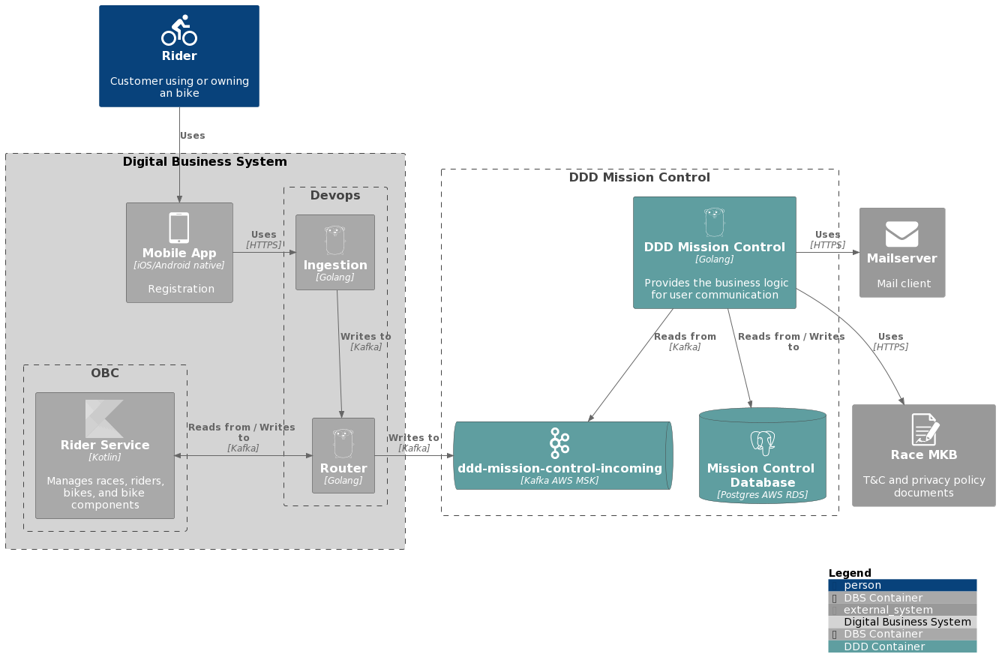
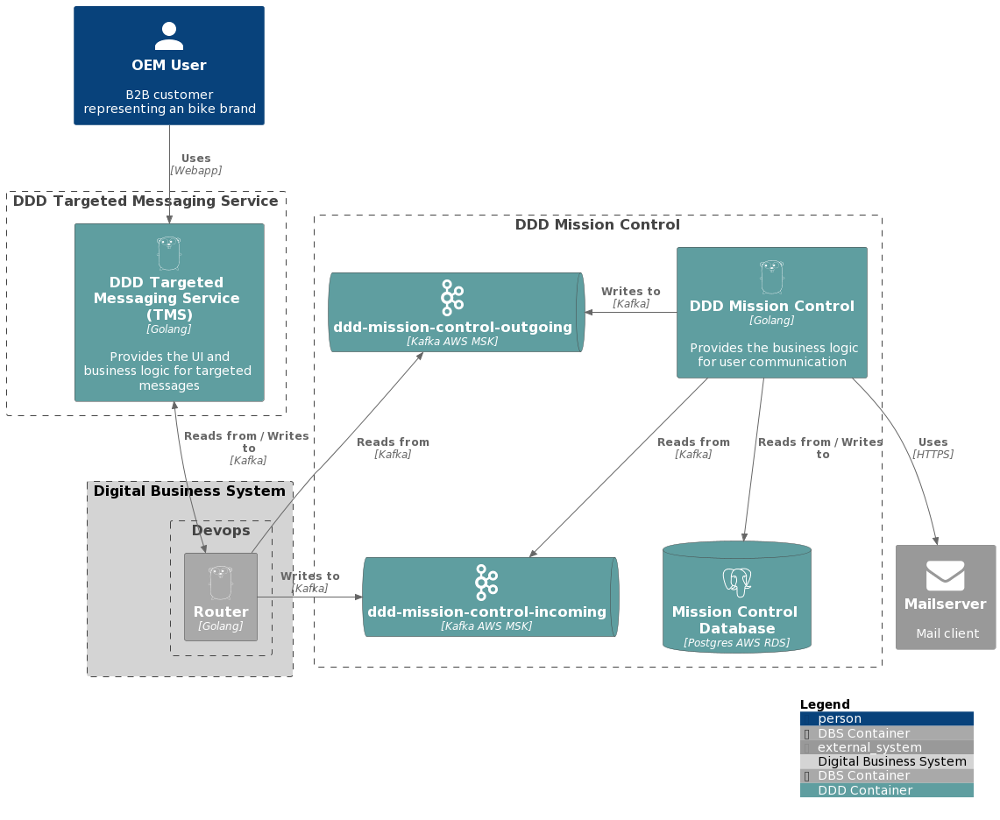
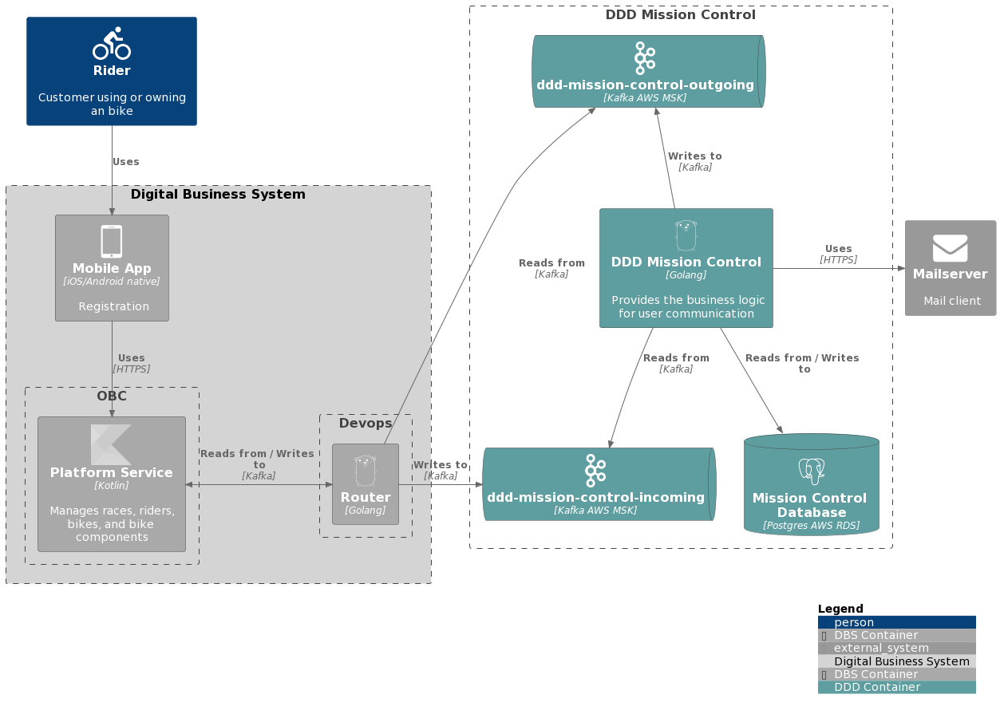
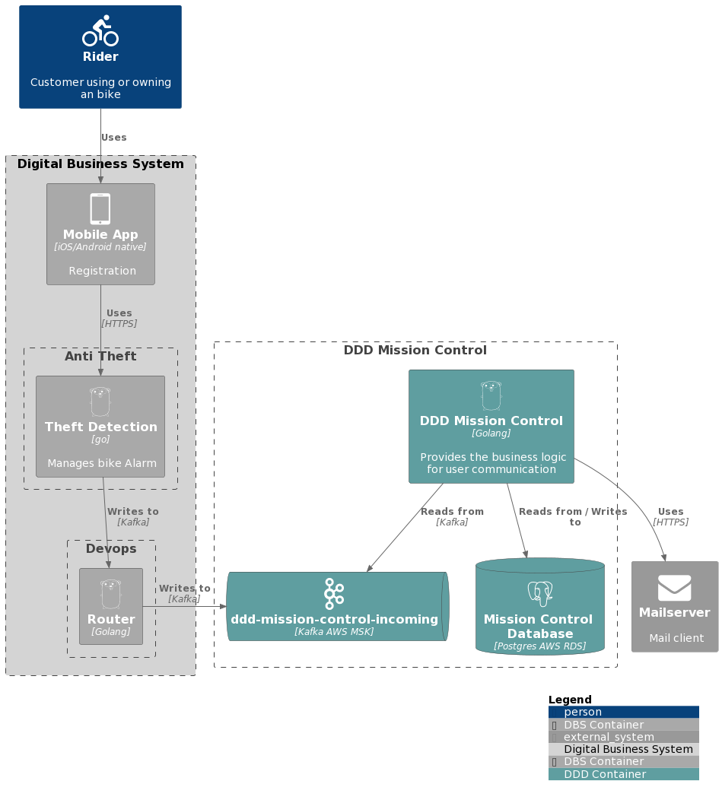

# Bicycle Racing Platform - DDD Mission Control (MC) Use Cases

## Welcome Mail
When a user registers through the app we have to send out a welcome mail containing legal documents (terms and conditions and privacy policy).

When MC receives a riderProfileChange message we check if the user has already received a welcome mail or not and if not, we send one.

### Architecture (C4 diagram)

The green boxes are managed by DDD.

### Re-registration
Re-registration is when a user deletes his/her account and later creates a new one. Since user ids are not unique, we have to do some additional work to support this.

Specifically, we need to detect if the latest deletion happened before the creation date of the `riderProfileChange` event, since we could receive out-of-order messages. 

There is a proposal to introduce a unique `bike-rider-id`, but it is not available yet, plus the migration might be complicated since we use user ids in our relations and as primary keys.

### Legal compliance
Since we send legal documents, we need to be able to prove which version was sent to the user (legal requirement).
This is done by inference through comparing the send-out date with which version of the legal document was stored on the MKB legal document CDN.
We store this information in the `mailing_log` table and mark rows as deleted without actually deleting them.
This data can be deleted after 10 years (at which point we should add a cronjob to do the deletion).

### TODOs:
* If we receive out-of-order deletion/re-registration events (we process re-registration before the deletion), we do not send out a welcome mail

## Update T&C Mailing
Terms and conditions are infrequently updated by MKB. When they are, we need to send out a new version to all bike riders who received an older version. 

This is done by MKB providing us a timestamp that is propagated to vault under `TC_UPDATE_TIMESTAMP`. The cronjob must be started manually. 
Note, it will currently write a kafka message for almost all users which will block the incoming topic for several hours.   

### TODOs:
* Use case implementation is not idempotent
* Use case blocks incoming topic for hours, ideas:
  * Put in a timeout between batches (several minutes)
  * Create a transactional outbox (write all messages to a database table and have a second job that reads from this table every x minutes)
  * Let a different service consume the t&cs mailing (requires sharing of the database)
  * Create a low prio incoming topic (only pull from if X-incoming is empty)

## Targeted Messaging Service (TMS)
TMS can trigger MC to send out messages to users via a targetedMessagingEmailDialogueProcessed message
Once send-out has completed, a targetedMessagingEmailDialoguePublished message is returned.

TMS can also trigger a targetedMessagingEmailDialogueTestMessagePublished message, but this is treated as a fire-and-forget and no response is made.

### Architecture (C4 diagram)

### TODOs:
* Use case implementation is not idempotent
* Failure to send out the last mail will mean the entire message is retried, see bullet above

## B2C User Deletion
B2C user deletion is triggered by the obc-platform-service by sending a userDeletedEvent message.
We have to clean our db as well as our external services (mailserver).

One completed, we send a userDeletedEventResponse message.

Due to legal requirements we have to track which legal document users received for ten years. See Legal Compliance under the Welcome Mail section for further details.
We keep track of the ten years by storing user deletions in the `user_deletions` table.

### Architecture (C4 diagram)

### TODO:
* We currently mark all rows as deleted without deletion, even TMS / Bike alarm mails.

## Bike Alarm Mailing (Trial Activation, Trial Expiration)
We enable the anti-theft team to send out Bike Alarm mails for their alarm trial feature. The theft-detection service sends alarmFreeTrialPeriodEvent message containing an event type.
Based on the event type we send out an activation mail (`TRIALACTIVATED` or `TRIALEXTENDED` if no current trial exists, otherwise we extend the trial) or a cancellation mail (`TRIALCANCELED`). 
Once the trial expires, we also send out a cancellation mail.

### Architecture (C4 diagram)

### TODO:
* Expiration cron job runs once a day. Should it run more often? Has to be clarified with anti-theft.

--------------------------------------
